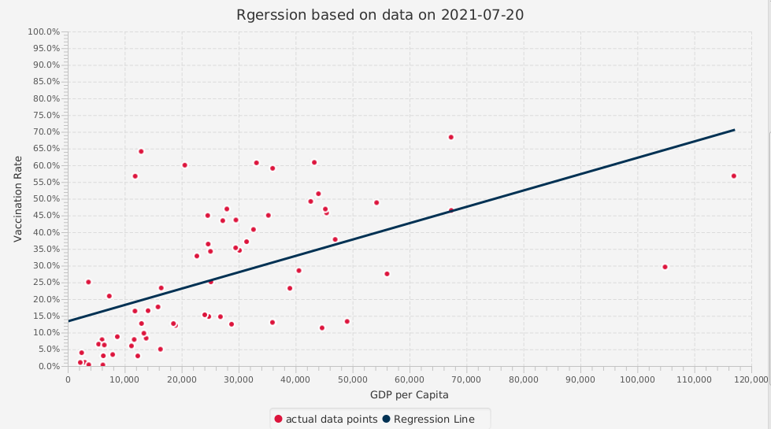

# COMP3111-T40-COVID19Project

Project repo: https://github.com/SKC-UST/COMP3111-T40-COVID19Project.git

## 1. CHOI, Siu Kai
email: skchoiab | github: SKC-UST | dev-branch: nk_feature1  Tasks: A1, A2

## 2. CHOW, Ngo Kiu
email: nkchow | github: calmChowder3 | dev-branch: yanton-feature-C Task C1, C2, C3

## 3. WONG, Wai Yin
email: wywongbp | github: wwyjason | dev-branch: jason-feature-B Task B1, B2

## Task C3 Problem and Solutions Statement
[Task c3 document](./docs/task-C3-details.md)

## Javadoc, JUnit Test Report, Jacoco Coverage Report and Supplementary Document
[Javadoc and Test Reports](https://skc-ust.github.io/COMP3111-T40-COVID19Project/)

## Sample execution of task A1

## Sample execution of task B1

## Sample execution of task C1

## Sample execution of task A2

## Sample execution of task B2

## Sample execution of task C2

## Sample execution of task C3

