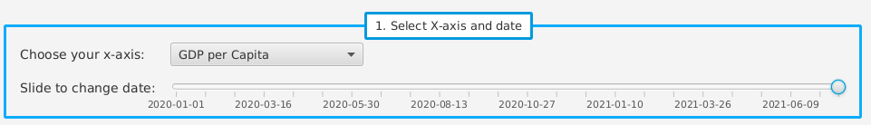
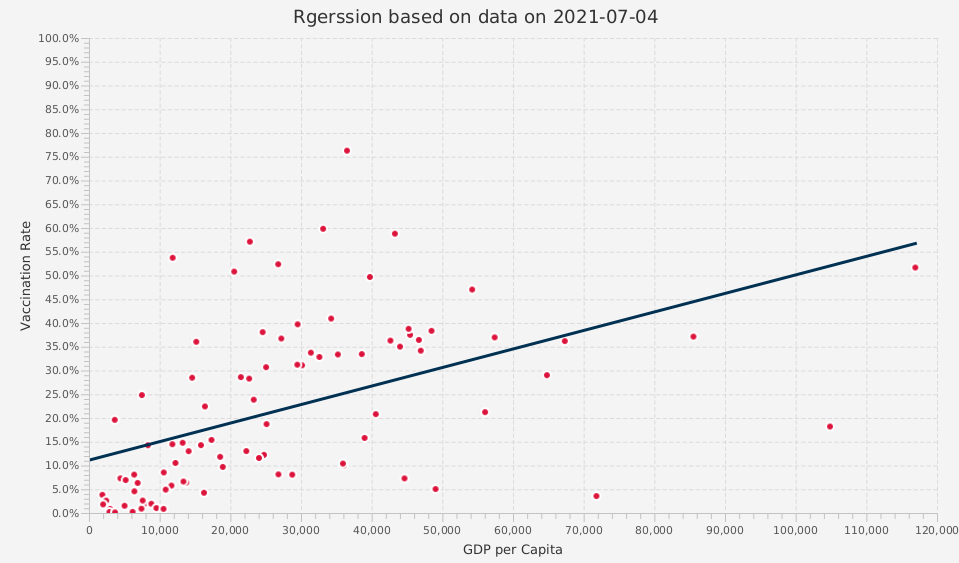
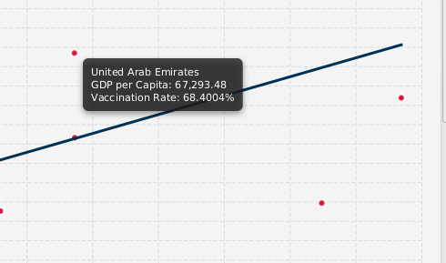
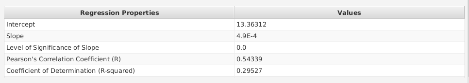

# Details on Task C3

## Problem Statement

Governments nowadays are trying their best to encourage their citizens to be vaccinated, in order alleviate the pandemic as much as possible. However, there are a lot of factors affecting the vaccination rate of the countries' citizens. If governments understand these factors, they can make policies accordingly to increase the vaccination rate. Usually, these factors lie within a country's attributes. The question is, **what are the attributes affecting the vaccination rate?**.

## Solution Statement

To answer the question, we can go some representative attributes of a country, and see how correlated are these attributes are with vaccination rate. To do so, I have opted to use **linear regression** to study the relationship between a country's attributes and their vaccination rates. An attribute is first chosen, say, GDP per capita. Then, vaccination rate is plotted against the chosen countries' attribute. Linear regression is useful in showing the relationship between the attribute and vaccination rate. For example, if GDP per capita is very positively correlated with vaccination rate, then a country with higher GDP per capita should have higher vaccination rate. We can then study the regression's Pearson Correlation Coefficient to have a quantitative measure of how correlated the attribute is with vaccination rate.

Therefore, the program incorporated the following features to facilitate the user's understanding of the statistical inference and later decision making.

### Features to facilitate knowledge discovery

#### Date Slider and Combobox

Because the vaccination rate is different as time goes by, it is important to see the regression across all available dates to have a bigger picture. Dragging the slider across different dates will yield the regression results of that day. An interactive slider is chosen because this graph is **dynamic**. Meaning, it is important for the user to drag the slider and see, in motion, how data is changing ass time went by.

As stated in the problem and solution statement, the goal was not only to show linear regression of vaccination rate against one attribute, but to compare the different factors affecting rate of vaccination. There is a combobox for choosing one of many countries' attributes for performing linear regression.

*note: In the sample dataset, rate of vaccination data is unvailable until late December of 2020. Therefore, users may need to drag the slider to a later date to see meaningful data.*

#### Chart

The chart shows the actual data points and the regression line. This is to give the user a big picture of the how result of regression compares to actual data. In the chart each data point represents a country. The chart updates itself dynamically as the user changes the date or the x-axis. This is to give the high degree of interaction between the user and the program, which is useful for the user to understand how data changes over time and across different countries' attributes.

#### Tooltip

Pointing at a datapoint on the chart will show the user a tooltip. The tooltip reveals which country that data point is representing and the concrete x and y values of the data point. While the chart is useful in giving users a big-picture impression, these tooltips shows details. Moreover, revealing the country's name is important because there are some factors, such as culture, that cannot be described using numbers. Tooltips therefore allow users to pinpoint a certain country and perform deeper qualitative analysis based on this regression result and data presented. 

#### Table showing concrete regression results

While the graph gives an overall impression of the linear regression performed on the data, the table shows concrete numbers given by the regression. In particular, to answer the problem statement: "how does one attribute affect vaccination rate?" It is useful to look the "Pearson Correlation Coefficient". The coefficient ranges between -1 and 1. The closer its value to 1 is, the more rate of vaccination is positively correlated the chosen attribute. Conversely, if its value is 0, then rate of vaccination is completely not related to that attribute.

#### Interactive 

Most importantly, this report is interactive. Not only does this make the process of knowledge discovery fun and interesting for the user, it also make it quicker. Choosing a different attribute for the x-axis will instantly change the graph and table to reflect the chosen attribute. Similarly, sliding the date slider will also change the graph and table accordingly.

