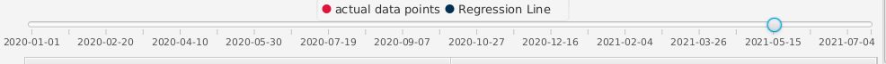

# Details on Task C3

## Problem Statement

Governments nowadays are trying their best to encourage their citizens to be vaccinated, in order alleviate the pandemic as much as possible. However, there are a lot of factors affecting the vaccination rate of the countries' citizens. The question is, **what attributes of the country are affecting the vaccination rate?**. Having the insight as to what is affecting the vaccination rate, governments can improve it with different ways.

## Solution Statement

I have opted to use **linear regression** to study the relationship between a country's attributes and their vaccination rates. An attribute is first chosen, say, GDP per capita. Then, it is used as the x-value and vaccination rate as a y-value. Linear regression is useful in showing the relationship between the attribute and vaccination rate. For example, if GDP per capita is positively correlated with vaccination rate, then a country with higher GDP per capita should have higher vaccination rate.

### Features to facilitate knowledge discovery

#### Date Slider

Because the vaccination rate is different as time goes by, it is important to see the regression across all avaialble dates to have a bigger picture. Dragging the slider across different dates will yield the regression results of that day. 

*note: In the sample dataset, rate of vaccination data is unvailable until late December of 2020. Therefore, users may need to drag the slider to a later date to see meaningful data.*

#### Choosing X-axis

As stated in the problem and solution statement, the goal was not only to show linear regression of vaccination rate against one attribute, but to compare the different factors affecting rate of vaccination. Therefore, on top of the chart, there is a combobox for choosing one of many countries' attributes for performing linear regression.

#### Chart

The chart shows the actual data points and the regression line. This is to give the user a big picture of the how result of regression compares to actual data. In the chart each data point represents a country. The chart updates itself as the user changes the date or the x-axis.

#### Table showing concrete regression results

While the graph gives an overall impression of the linear regression performed on the data, the table shows concrete numbers given by the regression. In particular, to answer the problem statement: "how does one attribute affect vaccination rate?" It is useful to look the "Pearson Correlation Coefficient". The coefficient ranges between -1 and 1. The closer its value to 1 is, the more rate of vaccination is positively correlated the chosen attribute. Conversely, if its value is 0, then rate of vaccination is completely not related to that attribute.

#### Interactive 

Most importantly, this report is interactive. Not only does this make the process of knowledge discovery fun and interesting for the user, it also make it quicker. Choosing a different attribute for the x-axis will instantly change the graph and table to reflect the chosen attribute. Similarly, sliding the date slider will also change the graph and table accordingly.

